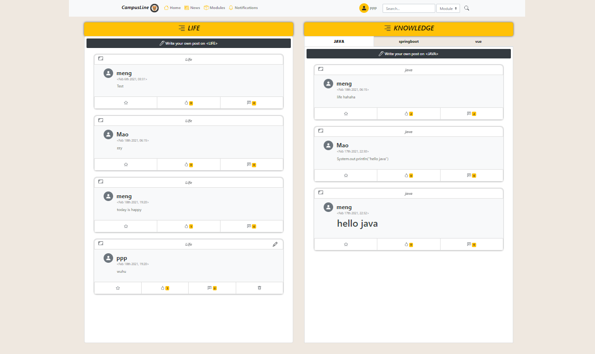
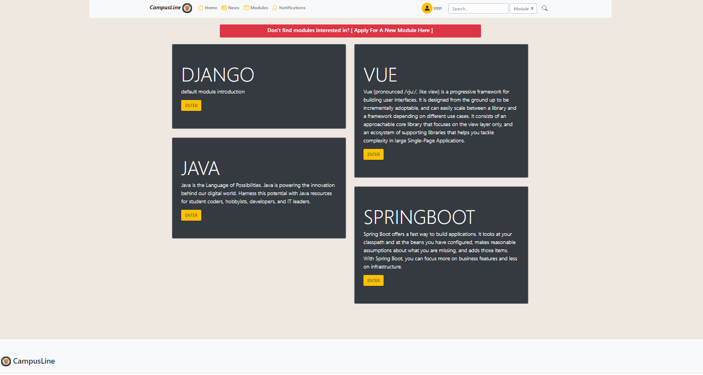
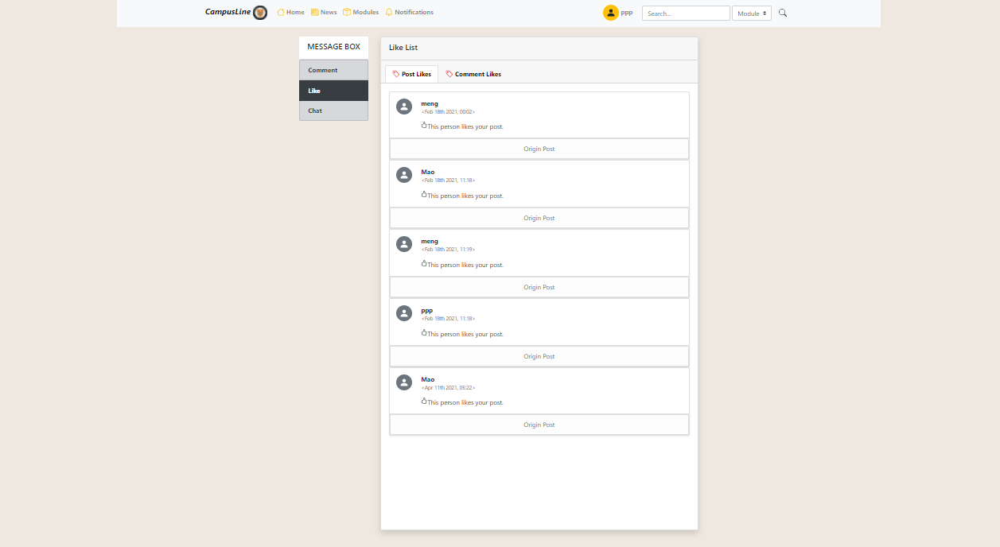
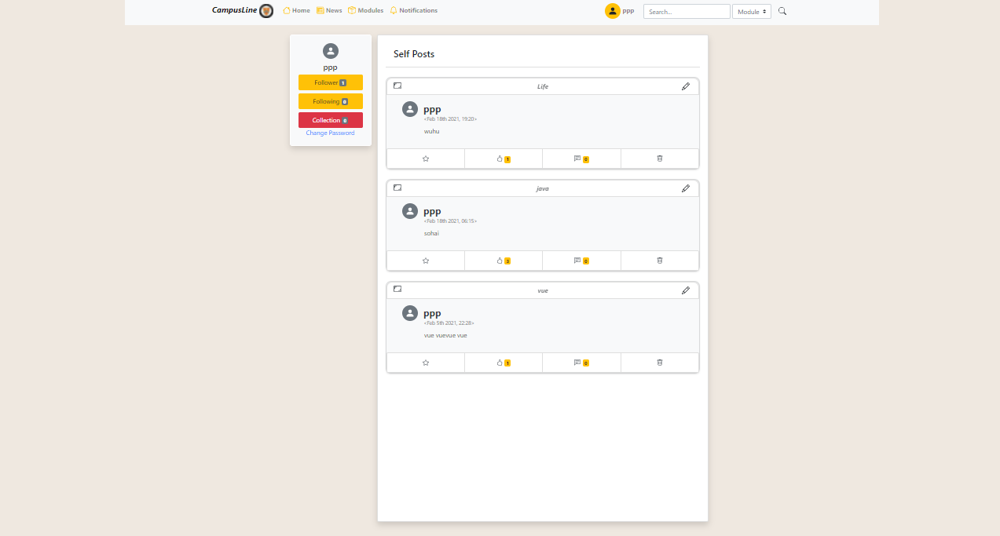

# CampusLine - a socializing and knowledge-sharing platform
A Social Nerworking Services(SNS) web application based on SpringBoot, Vue.js, Mybatis and Mysql


## Table of Contents
* [Introduction](#introduction)
* [Technologies](#technologies)
* [Functionalities](#functionalities)
* [Structure](#structure)
* [Launch](#launch)
* [Examples](#examples)

## Introduction
* CampusLine is a social networking & knowledge-sharing web application for students to address a couple of problems caused by online learning.

* It makes communicating with classmates about daily lives and course problems more convenient.

## Technologies
* For the whole system life cycle, we use agile development methods: Regular group meeting, GitLab version control, GitLab Issue Board and  Online sharing documents.

* We seperate the frontend and backend for easier development.

* For the front-end, we use Vue.js as the basic framework, and BootStrap to provide outlooks.

* For back-end, we use SpringBoot framework as fundemental framework.

* As for database, we choose Mybatis as persistence framework, Druid as connection pool, and Mysql as database.

* When testing our application, we use Junit for the unit testing, swagger-ui for interface testing and NightWatch for end-to-end testing.


## Functionalities
### Our application are generally used by 3 roles:
* Visitors: They can sign up, log in, browse homepage and hotposts, and search posts or users in the platform.

* Logined Users: They share the same functions visitors have. Besides, they can manage their profiles, publish posts, publish comments, like posts, follow their interested users, apply for module administrator, and send direct messages to others.

* Module Administrator: With the functions the above 2 roles have, they are given the authorization to create or delete modules, manage posts in their responsible modules.

## Structure
### This is  the main structure of back-end:
```
+---src
|   +---main
|   |   +---java
|   |   |   \---com
|   |   |       \---example
|   |   |           \---project
|   |   |               |   SpringBootProjectApplication.java
|   |   |               +---config
|   |   |               +---controller  
|   |   |               +---entity
|   |   |               +---mapper
|   |   |               +---result
|   |   |               +---service  
|   |   |               |   \---Impl 
|   |   |               \---utils
|   |   \---resources
|   |       |   application.yml
|   |       |   generatorConfig.properties
|   |       |   generatorConfig.xml
|   |       \---mapper
``` 
* SpringBootProjectApplication.java is the entrance of our application, the application will get started when runnning it.

* The folder controller comprises the interfaces between front-end and back-end.

* The foleder entity consists of entities in application.

* The folder mapper contains interfaces to manipulate database.

* The folder service contains service interfaces and their implementation.

* The folder utils contains utility classes needed by application.

* The folder resources contains configuration files and mybatis xml files.

### This is the main structure of front-end:
```
+---config
+---e2e_test       
+---mochawesome-report
+---node_modules
+---output    
+---reports       
+---src
|   |   App.vue
|   |   main.js
|   +---assets
|   +---components
|   +---router
|   +---test        
|   \---view
+---static                           
+---test      
\---tests_output
```
* config is configuration file folder.

* e2e_test, mochawesome-report, output, reports, test, and tests_output are testing codes and result output files.

* node_modules contains all the dependencies our system needs.

* App.vue is a template that all the pages uses, and main.js tells what tools we use, and some other basic configures like the baseURL.

* components comprise the components needed by pages.

* router controls the router information between pages and URLs.

* view is pages.

## Launch
### 1. Run the back-end:
* Prepare Database, you need to run the db.sql in the repository to generate the database table structures. Change the database username and password to your owns in spring-boot-project/src/main/resources/generatorConfig.properties

* Import the spring-boot-project folder as Maven project, run maven install to install necessary dependencies.

* Run SpringBootProjectApplication to start the back-end application.

### 2. Run the front-end:
* You need to install Node.js first.

* After installing Node.js, install needed dependencies by running:
```
\ vue-project> npm install
```
* Start the front-end project by running:
```
\ vue-project> npm run dev
```

* The terminal will tell you the URL where the project runs

## Examples

### 1. This is the homepage


### 2. This is the module homepage


### 3. This is one of the module pages


### 4. This is the notification page


### 5. This is the profile page


### More pages will be found when you run our application
